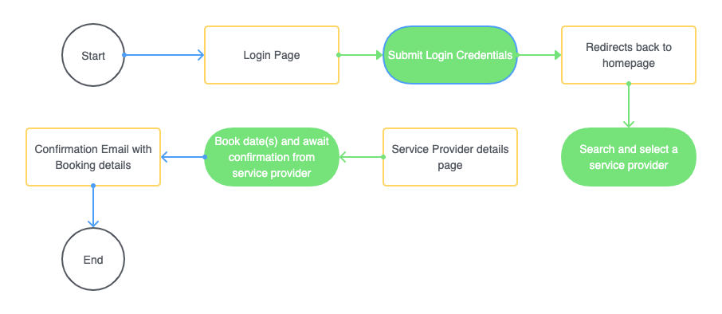
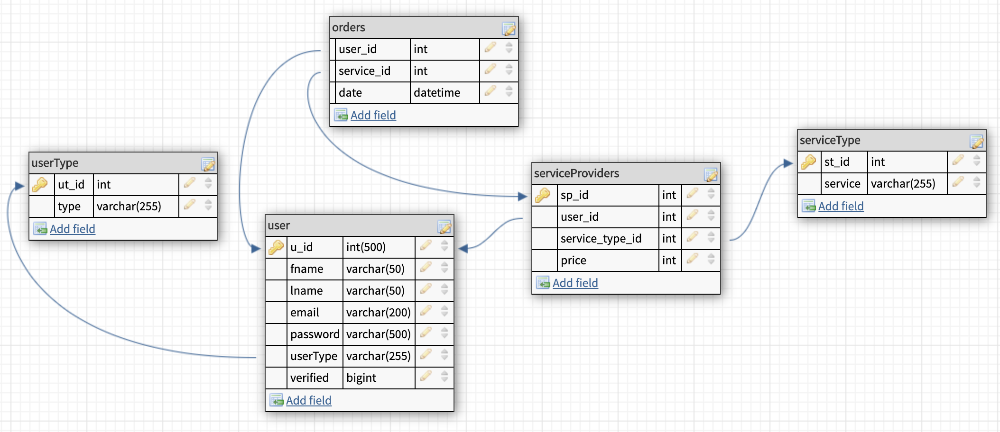
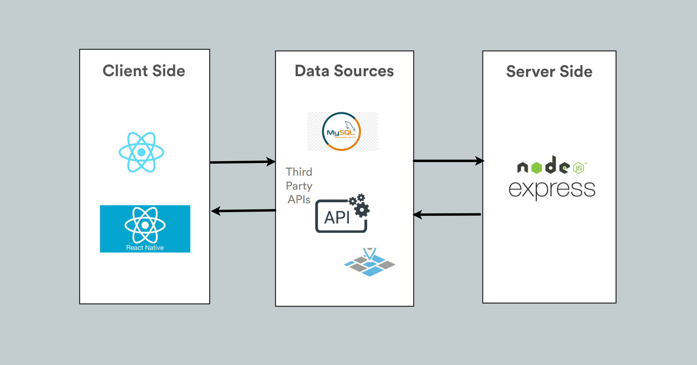

# Get It Done
Need help there mate? Let me give you a hand, for a price!

## Description

## Features

- [ ] Sign Up Page - Users should be able to sign up with Google, Facebook or with an email address
- [ ] Login page
- [ ] User Profile for both vendors and users
- [ ] Search function for a variety of services and price range

## User flow

## Database Schema

## Technologies

## Future implementations

- [ ] Showing a Map with pointers to possible vendors
- [ ] Email notifications
- [ ] Reviews on both users offering services and people using those services
- [ ] Online payment options - Debit/Credit card, Bitcoin, PayPal
- [ ] Calendar scheduling - Allow user to add to their calendar as well as view their schedule online
- [ ] Mobile App - Create a mobile app version using React Native

 _This is a student project that was created at [CodeOp](http://codeop.tech), a full stack development bootcamp in Barcelona._
