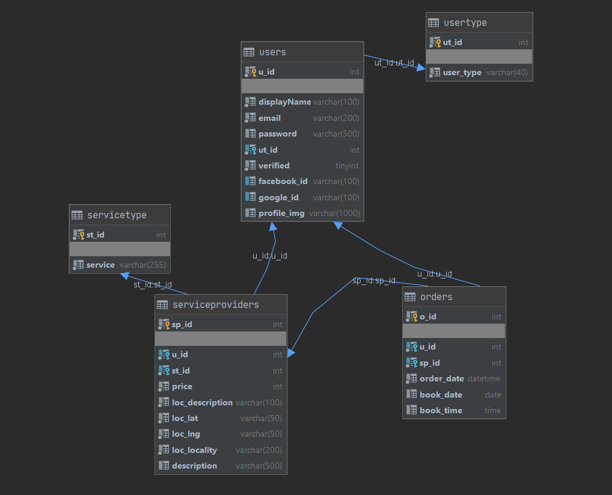
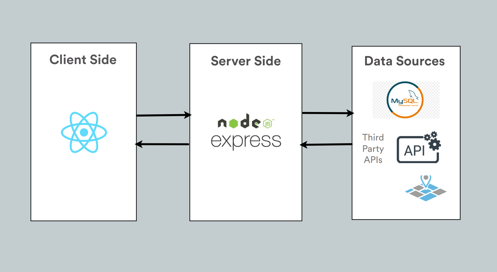

# Get It Done
Need help there mate? Let me give you a hand, for a price!

## Features

- [x] Sign Up & Login pop up
- [x] Enable user to sign up or login automatically via Facebook & Google
- [x] User profile
- [x] Search services outside and nearby you via types of services
- [x] Map display on nearby services
- [x] Enable to become a vendor yourself
- [x] Booking services from other vendors
- [x] Email notifications

## User flow

## Database Schema

## Technologies

## Future implementations

- [ ] Search along with price range
- [ ] Verified vendors
- [ ] Reviews for vendors and users
- [ ] Traditional online payment & cyptocurrency payment method
- [ ] RSVP 
- [ ] Mobile App - Create a mobile app version using React Native

 _This is a student project that was created at [CodeOp](http://codeop.tech), a full stack development bootcamp in Barcelona._
